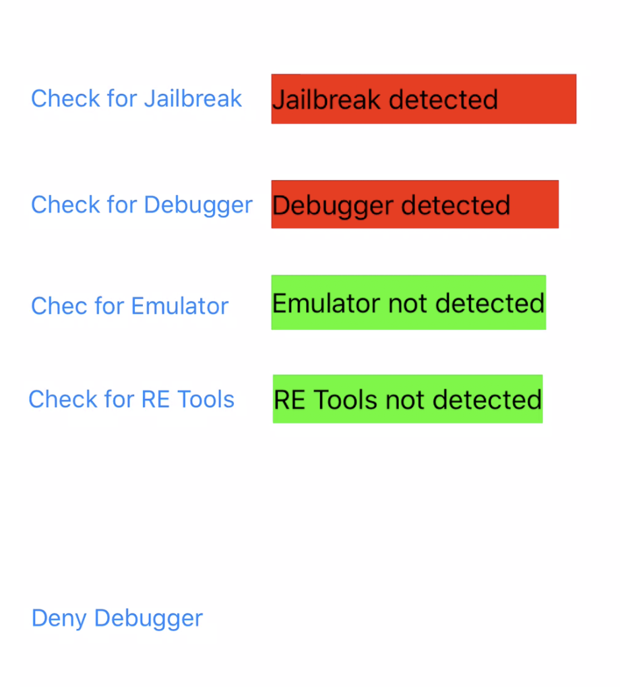

# SwiftSecurity

This is a PoC implementing the IOS Security Suite <https://github.com/securing/IOSSecuritySuite>

The following checks can be run:
- Jailbreak Detection
- Debugger Detection
- Emulator Detection
- Reverse Engineering Tools Detection 

And the Deny Debugger function.

A precompiled IPA can be found in the root directory SwiftSecurity.ipa. You would need to resign it before running on your device.

Current look of the app:

